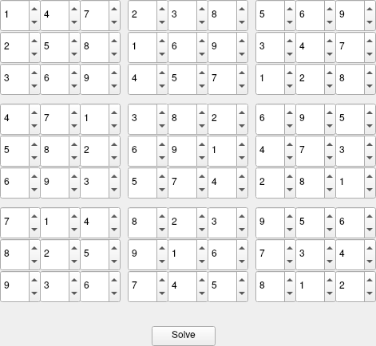

# SudokuSolverQt
Reimplemented my previous project (sudoku solver) with a simple GUI

# Install

```
qmake && make
```

# Usage

```
./SudokuSolverQt
```

When the GUI appears, 9 cells for input will be shown. It is recommended to start from the top left cell, type in a number (1-9) and then tab through the rest of the cells. It is not required to use the arrow buttons for input. The number 0 is left for blank spaces to be filled by the program. Press the "Solve" button for solution.

# Screenshot

